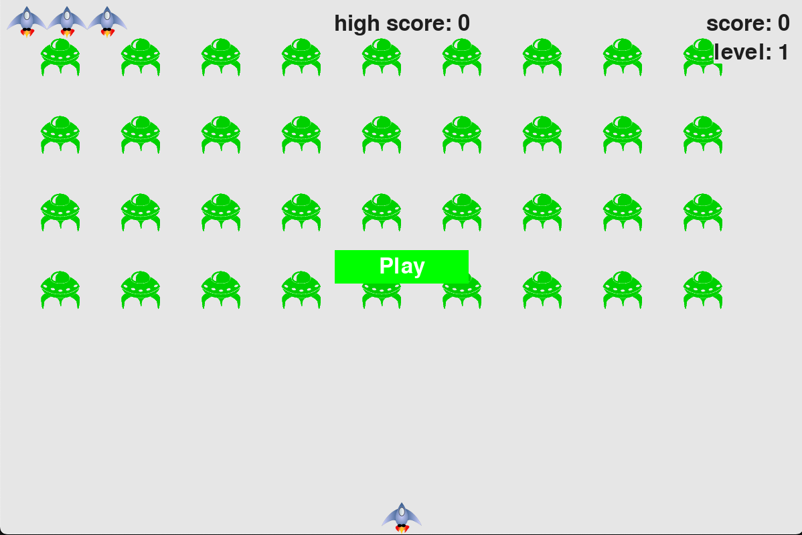

# Alien Invaders

## Installation

To clone the project; navigate to your desired directory on your command line of choice, then type `git clone https://github.com/Acer0ni/alien-invasion.git`.

This project requires pipenv to run. To install pipenv, type `pip3 install pipenv` , then `pipenv sync` to install the required dependencies.

After dependencies are installed you can run the game with `python3 alien_invasion.py`

## Play

To play you can move left and right with the arrow keys and spacebar to shoot. The waves get harder after each wave, and are infinite.
